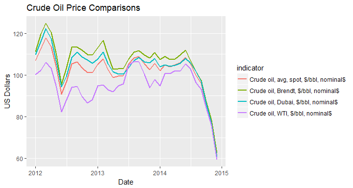
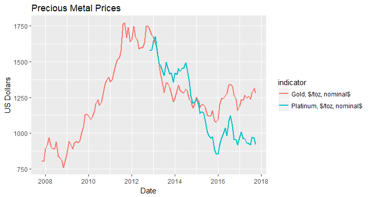

<!-- README.md is generated from README.Rmd. Please edit that file -->
wbstats: An R package for searching and downloading data from the World Bank API.
=================================================================================

You can install:

The latest release version from CRAN with

``` r
install.packages("wbstats")
```

or

The latest development version from github with

``` r
devtools::install_github("GIST-ORNL/wbstats")
```

Introduction
============

The World Bank[1] is a tremendous source of global socio-economic data; spanning several decades and dozens of topics, it has the potential to shed light on numerous global issues. To help provide access to this rich source of information, The World Bank themselves, provide a well structured RESTful API[2]. While this API is very useful for integration into web services and other high-level applications, it becomes quickly overwhelming for researchers who have neither the time nor the expertise to develop software to interface with the API. This leaves the researcher to rely on manual bulk downloads of spreadsheets of the data they are interested in. This too is can quickly become overwhelming, as the work is manual, time consuming, and not easily reproducible. The goal of the `wbstats` R-package is to provide a bridge between these alternatives and allow researchers to focus on their research questions and not the question of accessing the data. The `wbstats` R-package allows researchers to quickly search and download the data of their particular interest in a programmatic and reproducible fashion; this facilitates a seamless integration into their workflow and allows analysis to be quickly rerun on different areas of interest and with realtime access to the latest available data.

### Highlighted features of the `wbstats` R-package:

-   Access to all annual, quarterly, and monthly data available in the API
-   Support for searching and downloading data in multiple languages
-   Access to the World Bank Data Catalog Metadata, providing among other information; update schedules and supported languages
-   Ability to return `POSIXct` dates for easy integration into plotting and time-series analysis techniques
-   Returns data in long format for direct integration with packages like `ggplot2` and `dplyr`
-   Support for Most Recent Value queries
-   Support for `grep` style searching for data descriptions and names
-   Ability to download data not only by country, but by aggregates as well, such as High Income or South Asia
-   Ability to specify `countries_only` or `aggregates` when querying data

Getting Started
===============

Unless you know the country and indicator codes that you want to download the first step would be searching for the data you are interested in. `wbsearch()` provides `grep` style searching of all available indicators from the World Bank API and returns the indicator information that matches your query.

To access what countries or regions are available you can use the `countries` data frame from either `wb_cachelist` or the saved return from `wbcache()`. This data frame contains relevant information regarding each country or region. More information on how to use this for downloading data is covered later.

Finding available data with `wb_cachelist`
------------------------------------------

For performance and ease of use, a cached version of useful information is provided with the `wbstats` R-package. This data is called `wb_cachelist` and provides a snapshot of available countries, indicators, and other relevant information. `wb_cachelist` is by default the the source from which `wbsearch()` and `wb()` uses to find matching information. The structure of `wb_cachelist` is as follows

``` r
library(wbstats)

str(wb_cachelist, max.level = 1)
#> List of 7
#>  $ countries  :'data.frame': 304 obs. of  18 variables:
#>  $ indicators :'data.frame': 16978 obs. of  7 variables:
#>  $ sources    :'data.frame': 43 obs. of  8 variables:
#>  $ datacatalog:'data.frame': 238 obs. of  29 variables:
#>  $ topics     :'data.frame': 21 obs. of  3 variables:
#>  $ income     :'data.frame': 7 obs. of  3 variables:
#>  $ lending    :'data.frame': 4 obs. of  3 variables:
```

Accessing updated available data with `wbcache()`
-------------------------------------------------

For the most recent information on available data from the World Bank API `wbcache()` downloads an updated version of the information stored in `wb_cachelist`. `wb_cachelist` is simply a saved return of `wbcache(lang = "en")`. To use this updated information in `wbsearch()` or `wb()`, set the `cache` parameter to the saved `list` returned from `wbcache()`. It is always a good idea to use this updated information to insure that you have access to the latest available information, such as newly added indicators or data sources.

``` r
library(wbstats)

# default language is english
new_cache <- wbcache()
```

Search available data with `wbsearch()`
---------------------------------------

`wbsearch()` searches through the `indicators` data frame to find indicators that match a search pattern. An example of the structure of this data frame is below

|      | indicatorID              | indicator                                                     | unit | indicatorDesc                                                                                              | sourceOrg | sourceID | source                                                              |
|------|:-------------------------|:--------------------------------------------------------------|:-----|:-----------------------------------------------------------------------------------------------------------|:----------|:---------|:--------------------------------------------------------------------|
| 4310 | per\_sa\_su.ben\_q5\_urb | Benefits incidence in richest quintile (%) - Subsidies -urban | NA   | Percentage of benefits going to the richestquintile relative to the total benefits going to the population | ASPIRE    | 29       | The Atlas of Social Protection: Indicators of Resilience and Equity |
| 4311 | per\_sa\_su.ben\_q5\_tot | Benefits incidence in richest quintile (%) - Subsidies        | NA   | Percentage of benefits going to the richestquintile relative to the total benefits going to the population | ASPIRE    | 29       | The Atlas of Social Protection: Indicators of Resilience and Equity |

By default the search is done over the `indicator` and `indicatorDesc` fields and returns the columns `indicatorID` and `indicator` of the matching rows. The `indicatorID` values are inputs into `wb()`, the function for downloading the data. To return all columns for the `indicators` data frame, you can set `extra = TRUE`.

``` r
library(wbstats)

unemploy_vars <- wbsearch(pattern = "unemployment")
head(unemploy_vars)
#>               indicatorID
#> 1849       SL.UEM.TOTL.ZS
#> 1850    SL.UEM.TOTL.NE.ZS
#> 1851    SL.UEM.TOTL.MA.ZS
#> 1852 SL.UEM.TOTL.MA.NE.ZS
#> 1853    SL.UEM.TOTL.FE.ZS
#> 1854 SL.UEM.TOTL.FE.NE.ZS
#>                                                                  indicator
#> 1849   Unemployment, total (% of total labor force) (modeled ILO estimate)
#> 1850      Unemployment, total (% of total labor force) (national estimate)
#> 1851     Unemployment, male (% of male labor force) (modeled ILO estimate)
#> 1852        Unemployment, male (% of male labor force) (national estimate)
#> 1853 Unemployment, female (% of female labor force) (modeled ILO estimate)
#> 1854    Unemployment, female (% of female labor force) (national estimate)
```

Other fields can be searched by simply changing the `fields` parameter. For example

``` r
library(wbstats)

blmbrg_vars <- wbsearch(pattern = "Bloomberg", fields = "sourceOrg")
head(blmbrg_vars)
#>        indicatorID                             indicator
#> 1489  RUBBER1_MYSG Rubber, Singapore, cents/kg, current$
#> 3279  WHEAT_US_HRW        Wheat, US, HRW, $/mt, current$
#> 4465      SUGAR_US         Sugar, US, cents/kg, current$
#> 7985    GFDD.SM.01                Stock price volatility
#> 7993    GFDD.OM.02 Stock market return (%, year-on-year)
#> 10633       BARLEY                Barley, $/mt, current$
```

Regular expressions are also supported.

``` r
library(wbstats)

# 'poverty' OR 'unemployment' OR 'employment'
povemply_vars <- wbsearch(pattern = "poverty|unemployment|employment")

head(povemply_vars)
#>          indicatorID
#> 437 UIS.GTVP.4.GPV.M
#> 438 UIS.GTVP.4.GPV.F
#> 439   UIS.GTVP.4.GPV
#> 443 UIS.GTVP.3.GPV.M
#> 444 UIS.GTVP.3.GPV.F
#> 445   UIS.GTVP.3.GPV
#>                                                                                                             indicator
#> 437     Percentage of male students in post-secondary non-tertiary education enrolled in general programmes, male (%)
#> 438 Percentage of female students in post-secondary non-tertiary education enrolled in general programmes, female (%)
#> 439    Percentage of students in post-secondary non-tertiary education enrolled in general programmes, both sexes (%)
#> 443                 Percentage of male students in upper secondary education enrolled in general programmes, male (%)
#> 444             Percentage of female students in upper secondary education enrolled in general programmes, female (%)
#> 445                Percentage of students in upper secondary education enrolled in general programmes, both sexes (%)
```

The default cached data in `wb_cachelist` is in English. To search indicators in a different language, you can download an updated copy of `wb_cachelist` using `wbcache()`, with the `lang` parameter set to the language of interest and then set this as the `cache` parameter in `wbsearch()`. Other languages are supported in so far as they are supported by the original data sources. Some sources provide full support for other languages, while some have very limited support. If the data source does not have a translation for a certain field or indicator then the result is `NA`, this may result in a varying number matches depending upon the language you select.

``` r
library(wbstats)

# download wbcache in spanish
wb_cachelist_es <- wbcache(lang = "es")

gini_vars <- wbsearch(pattern = "Coeficiente de Gini", cache = wb_cachelist_es)

head(gini_vars)
#>           indicatorID                                       indicator
#> 10099   3.2.TheilInd1                   Índice de Theil, GE(1),Urbano
#> 10101        3.2.Gini                                    Gini, Urbano
#> 10112   3.1.TheilInd1                   Índice de Theil, GE(1), Rural
#> 10114        3.1.Gini                                     Gini, Rural
#> 10117   3.0.TheilInd1                          Índice de Theil, GE(1)
#> 10126 3.0.Gini_nozero Coeficiente de Gini (Ingreso diferente de cero)
```

Downloading data with `wb()`
----------------------------

Once you have found the set of indicators that you would like to explore further, the next step is downloading the data with `wb()`. The following examples are meant to highlight the different ways in which `wb()` can be used and demonstrate the major optional parameters.

The default value for the `country` parameter is a special value of `all` which as you might expect, returns data on the selected `indicator` for every available country or region.

``` r
library(wbstats)

# Population, total
pop_data <- wb(indicator = "SP.POP.TOTL", startdate = 2000, enddate = 2002)

head(pop_data)
#>   iso3c date     value indicatorID         indicator iso2c
#> 1   ARB 2002 296026575 SP.POP.TOTL Population, total    1A
#> 2   ARB 2001 289850357 SP.POP.TOTL Population, total    1A
#> 3   ARB 2000 283832016 SP.POP.TOTL Population, total    1A
#> 4   CSS 2002   6623792 SP.POP.TOTL Population, total    S3
#> 5   CSS 2001   6577216 SP.POP.TOTL Population, total    S3
#> 6   CSS 2000   6530691 SP.POP.TOTL Population, total    S3
#>                  country
#> 1             Arab World
#> 2             Arab World
#> 3             Arab World
#> 4 Caribbean small states
#> 5 Caribbean small states
#> 6 Caribbean small states
```

If you are interested in only some subset of countries or regions you can pass along the specific codes to the `country` parameter. The country and region codes that can be passed to the `country` parameter correspond to the coded values from the `iso2c`, `iso3c`, `regionID`, `adminID`, and `incomeID` from the `countries` data frame in `wb_cachelist` or the return of `wbcache()`. Any values from the above columns can mixed together and passed to the same call

``` r
library(wbstats)

# Population, total
# country values: iso3c, iso2c, regionID, adminID, incomeID
pop_data <- wb(country = c("ABW","AF", "SSF", "ECA", "NOC"),
               indicator = "SP.POP.TOTL", startdate = 2012, enddate = 2012)
#> Warning in wb(country = c("ABW", "AF", "SSF", "ECA", "NOC"), indicator =
#> "SP.POP.TOTL", : The following country values are not valid and are being
#> excluded from the request: NOC

head(pop_data)
#>   iso3c date     value indicatorID         indicator iso2c
#> 1   ABW 2012    102577 SP.POP.TOTL Population, total    AW
#> 2   AFG 2012  30696958 SP.POP.TOTL Population, total    AF
#> 3   ECA 2012 407706585 SP.POP.TOTL Population, total    7E
#> 4   SSF 2012 926548177 SP.POP.TOTL Population, total    ZG
#>                                         country
#> 1                                         Aruba
#> 2                                   Afghanistan
#> 3 Europe & Central Asia (excluding high income)
#> 4                            Sub-Saharan Africa
```

Queries with multiple indicators return the data in a long data format

``` r
library(wbstats)

pop_gdp_data <- wb(country = c("US", "NO"), indicator = c("SP.POP.TOTL", "NY.GDP.MKTP.CD"),
               startdate = 1971, enddate = 1971)

head(pop_gdp_data)
#>   iso3c date        value    indicatorID         indicator iso2c
#> 1   NOR 1971 3.903039e+06    SP.POP.TOTL Population, total    NO
#> 2   USA 1971 2.076610e+08    SP.POP.TOTL Population, total    US
#> 3   NOR 1971 1.458311e+10 NY.GDP.MKTP.CD GDP (current US$)    NO
#> 4   USA 1971 1.167770e+12 NY.GDP.MKTP.CD GDP (current US$)    US
#>         country
#> 1        Norway
#> 2 United States
#> 3        Norway
#> 4 United States
```

### Using `mrv`

If you do not know the latest date an indicator you are interested in is available for you country you can use the `mrv` instead of `startdate` and `enddate`. `mrv` stands for most recent value and takes a `integer` corresponding to the number of most recent values you wish to return

``` r
library(wbstats)

eg_data <- wb(country = c("IN"), indicator = 'EG.ELC.ACCS.ZS', mrv = 1)

eg_data
#>   iso3c date    value    indicatorID
#> 1   IND 2014 79.16926 EG.ELC.ACCS.ZS
#>                                 indicator iso2c country
#> 1 Access to electricity (% of population)    IN   India
```

You can increase this value and it will return no more than the `mrv` value. However, if `mrv` is greater than the number of available data it will return less

``` r
library(wbstats)

eg_data <- wb(country = c("IN"), indicator = 'EG.ELC.ACCS.ZS', mrv = 10)

eg_data
#>    iso3c date    value    indicatorID
#> 1    IND 2014 79.16926 EG.ELC.ACCS.ZS
#> 2    IND 2013 77.73752 EG.ELC.ACCS.ZS
#> 3    IND 2012 79.90000 EG.ELC.ACCS.ZS
#> 4    IND 2011 67.60000 EG.ELC.ACCS.ZS
#> 5    IND 2010 76.30000 EG.ELC.ACCS.ZS
#> 6    IND 2009 75.00000 EG.ELC.ACCS.ZS
#> 7    IND 2008 70.61525 EG.ELC.ACCS.ZS
#> 8    IND 2007 69.21004 EG.ELC.ACCS.ZS
#> 9    IND 2006 67.90000 EG.ELC.ACCS.ZS
#> 10   IND 2005 66.43195 EG.ELC.ACCS.ZS
#>                                  indicator iso2c country
#> 1  Access to electricity (% of population)    IN   India
#> 2  Access to electricity (% of population)    IN   India
#> 3  Access to electricity (% of population)    IN   India
#> 4  Access to electricity (% of population)    IN   India
#> 5  Access to electricity (% of population)    IN   India
#> 6  Access to electricity (% of population)    IN   India
#> 7  Access to electricity (% of population)    IN   India
#> 8  Access to electricity (% of population)    IN   India
#> 9  Access to electricity (% of population)    IN   India
#> 10 Access to electricity (% of population)    IN   India
```

### Using `gapfill = TRUE`

An additional parameter that can be used along with `mrv` is `gapfill`. `gapfill` allows you to "fill-in" the values between actual observations. The "filled-in" value for an otherwise missing date is the last observed value carried forward.The only difference in the data call below from the one directly above is `gapfill = TRUE` (the default is `FALSE`). Note the very important difference

``` r
library(wbstats)

eg_data <- wb(country = c("IN"), indicator = 'EG.ELC.ACCS.ZS', mrv = 10, gapfill = TRUE)

eg_data
#>    iso3c date    value    indicatorID
#> 1    IND 2017 79.16926 EG.ELC.ACCS.ZS
#> 2    IND 2016 79.16926 EG.ELC.ACCS.ZS
#> 3    IND 2015 79.16926 EG.ELC.ACCS.ZS
#> 4    IND 2014 79.16926 EG.ELC.ACCS.ZS
#> 5    IND 2013 77.73752 EG.ELC.ACCS.ZS
#> 6    IND 2012 79.90000 EG.ELC.ACCS.ZS
#> 7    IND 2011 67.60000 EG.ELC.ACCS.ZS
#> 8    IND 2010 76.30000 EG.ELC.ACCS.ZS
#> 9    IND 2009 75.00000 EG.ELC.ACCS.ZS
#> 10   IND 2008 70.61525 EG.ELC.ACCS.ZS
#>                                  indicator iso2c country
#> 1  Access to electricity (% of population)    IN   India
#> 2  Access to electricity (% of population)    IN   India
#> 3  Access to electricity (% of population)    IN   India
#> 4  Access to electricity (% of population)    IN   India
#> 5  Access to electricity (% of population)    IN   India
#> 6  Access to electricity (% of population)    IN   India
#> 7  Access to electricity (% of population)    IN   India
#> 8  Access to electricity (% of population)    IN   India
#> 9  Access to electricity (% of population)    IN   India
#> 10 Access to electricity (% of population)    IN   India
```

Because `gapfill` returns data that does reflect actual observed values, use this option with care.

### Using `POSIXct = TRUE`

The default format for the `date` column is not conducive to sorting or plotting, especially when downloading sub annual data, such as monthly or quarterly data. To address this, if `TRUE`, the `POSIXct` parameter adds the additional columns `date_ct` and `granularity`. `date_ct` converts the default date into a `POSIXct`. `granularity` denotes the time resolution that the date represents. This option requires the use of the package `lubridate (>= 1.5.0)`. If `POSIXct = TRUE` and `lubridate (>= 1.5.0)` is not available, a `warning` is produced and the option is ignored

``` r
library(wbstats)

oil_data <- wb(indicator = "CRUDE_BRENT", mrv = 10, freq = "M", POSIXct = TRUE)

head(oil_data)
#>   iso3c    date value indicatorID                          indicator iso2c
#> 1   WLD 2017M10 57.62 CRUDE_BRENT Crude oil, Brendt, $/bbl, nominal$    1W
#> 2   WLD 2017M09 55.16 CRUDE_BRENT Crude oil, Brendt, $/bbl, nominal$    1W
#> 3   WLD 2017M08 51.37 CRUDE_BRENT Crude oil, Brendt, $/bbl, nominal$    1W
#> 4   WLD 2017M07 48.69 CRUDE_BRENT Crude oil, Brendt, $/bbl, nominal$    1W
#> 5   WLD 2017M06 46.89 CRUDE_BRENT Crude oil, Brendt, $/bbl, nominal$    1W
#> 6   WLD 2017M05 50.87 CRUDE_BRENT Crude oil, Brendt, $/bbl, nominal$    1W
#>   country    date_ct granularity
#> 1   World 2017-10-01     monthly
#> 2   World 2017-09-01     monthly
#> 3   World 2017-08-01     monthly
#> 4   World 2017-07-01     monthly
#> 5   World 2017-06-01     monthly
#> 6   World 2017-05-01     monthly
```

The `POSIXct = TRUE` option makes plotting and sorting dates much easier.

``` r
library(wbstats)
library(ggplot2)

oil_data <- wb(indicator = c("CRUDE_DUBAI", "CRUDE_BRENT", "CRUDE_WTI", "CRUDE_PETRO"),
               startdate = "2012M01", enddate = "2014M12", freq = "M", POSIXct = TRUE)

ggplot(oil_data, aes(x = date_ct, y = value, colour = indicator)) + geom_line(size = 1) +
  labs(title = "Crude Oil Price Comparisons", x = "Date", y = "US Dollars")
```



The `POSIXct = TRUE` option also makes plotting time series with different time coverage seamless

``` r
library(wbstats)
library(ggplot2)

# querying seperate for differing time coverage example
gold_data <- wb(indicator = "GOLD", mrv = 120, freq = "M", POSIXct = TRUE)
plat_data <- wb(indicator = "PLATINUM", mrv = 60, freq = "M", POSIXct = TRUE)

metal_data <- rbind(gold_data, plat_data)

ggplot(metal_data, aes(x = date_ct, y = value, colour = indicator)) + geom_line(size = 1) +
  labs(title = "Precious Metal Prices", x = "Date", y = "US Dollars")
```



Some Sharp Corners
==================

There are a few behaviors of the World Bank API that being aware of could help explain some potentially unexpected results. These results are known but no special actions are taken to mitigate them as they are the result of the API itself and artifically limiting the inputs or results could potentially causes problems or create unnecessary rescrictions in the future.

Non-overlaping time frames
--------------------------

If you make a query with `wb()` and the `startdate` and `enddate` no not overlap at all with the available data, then all of the data is returned instead of nothing.

``` r
library(wbstats)

pop_data <- wb(country = "US", indicator = "SP.POP.TOTL", 
               startdate = 1800, enddate = 1805, POSIXct = TRUE)
#> Warning in wb(country = "US", indicator = "SP.POP.TOTL", startdate =
#> 1800, : No data was returned for any requested country and indicator.
#> Returning empty data frame

nrow(pop_data)
#> [1] 0
max(pop_data$date_ct)
#> Warning in max(pop_data$date_ct): no non-missing arguments to max;
#> returning -Inf
#> [1] -Inf
min(pop_data$date_ct)
#> Warning in min(pop_data$date_ct): no non-missing arguments to min;
#> returning Inf
#> [1] Inf
```

Most Recent Values
------------------

If you use the `mrv` parameter in `wb()` with mutliple countries or regions, it searches for the most recent dates for which any country or region in your selection has data and then returns the data for those dates. In other words the `mrv` value is not determined on a country by country basis, rather it is determined across the entire selection.

``` r
library(wbstats)

eg_data_1 <- wb(country = c("IN", "AF"), indicator = 'EG.FEC.RNEW.ZS', mrv = 1)
eg_data_1
#>   iso3c date    value    indicatorID
#> 1   AFG 2014 16.74900 EG.FEC.RNEW.ZS
#> 2   IND 2014 36.53617 EG.FEC.RNEW.ZS
#>                                                            indicator iso2c
#> 1 Renewable energy consumption (% of total final energy consumption)    AF
#> 2 Renewable energy consumption (% of total final energy consumption)    IN
#>       country
#> 1 Afghanistan
#> 2       India

eg_data_2 <- wb(country = c("IN", "AF"), indicator = 'EG.FEC.RNEW.ZS', mrv = 2)
eg_data_2
#>   iso3c date    value    indicatorID
#> 1   AFG 2014 16.74900 EG.FEC.RNEW.ZS
#> 2   AFG 2013 14.27845 EG.FEC.RNEW.ZS
#> 3   IND 2014 36.53617 EG.FEC.RNEW.ZS
#> 4   IND 2013 37.73270 EG.FEC.RNEW.ZS
#>                                                            indicator iso2c
#> 1 Renewable energy consumption (% of total final energy consumption)    AF
#> 2 Renewable energy consumption (% of total final energy consumption)    AF
#> 3 Renewable energy consumption (% of total final energy consumption)    IN
#> 4 Renewable energy consumption (% of total final energy consumption)    IN
#>       country
#> 1 Afghanistan
#> 2 Afghanistan
#> 3       India
#> 4       India
```

Searching in other languages
----------------------------

Not all data sources support all languages. If an indicator does not have a translation for a particular language, the non-supported fields will return as `NA`. This could potentially result in a differing number of matching indicators from `wbsearch()`

``` r

library(wbstats)

# english
cache_en <- wbcache()
sum(is.na(cache_en$indicators$indicator))
#> [1] 0

# spanish
cache_es <- wbcache(lang = "es")
sum(is.na(cache_es$indicators$indicator))
#> [1] 15084
```

Legal
=====

The World Bank Group, or any of its member instutions, do not support or endorse this software and are not libable for any findings or conclusions that come from the use of this software.

[1] <http://www.worldbank.org/>

[2] <http://data.worldbank.org/developers>
