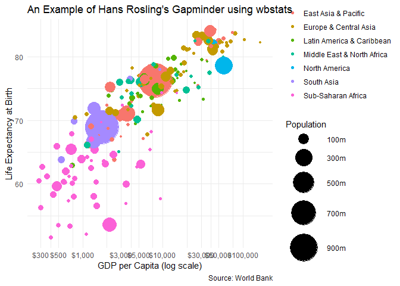

<!-- README.md is generated from README.Rmd. Please edit that file -->

wbstats: An R package for searching and downloading data from the World Bank API.
=================================================================================

You can install:

The latest release version from CRAN with

``` r
install.packages("wbstats")
```

or

The latest development version from github with

``` r
remotes::install_github("nset-ornl/wbstats")
```

Downloading data from the World Bank
====================================

``` r
library(wbstats)

# Population for every country from 1960 until present
d <- wb_data("SP.POP.TOTL")
    
head(d)
#> # A tibble: 6 x 9
#>   iso2c iso3c country  date SP.POP.TOTL unit  obs_status footnote
#>   <chr> <chr> <chr>   <dbl>       <dbl> <chr> <chr>      <chr>   
#> 1 AW    ABW   Aruba    2019          NA <NA>  <NA>       <NA>    
#> 2 AW    ABW   Aruba    2018      105845 <NA>  <NA>       <NA>    
#> 3 AW    ABW   Aruba    2017      105366 <NA>  <NA>       <NA>    
#> 4 AW    ABW   Aruba    2016      104872 <NA>  <NA>       <NA>    
#> 5 AW    ABW   Aruba    2015      104341 <NA>  <NA>       <NA>    
#> 6 AW    ABW   Aruba    2014      103774 <NA>  <NA>       <NA>    
#> # ... with 1 more variable: last_updated <date>
```

Hans Rosling’s Gapminder using wbstats
--------------------------------------

``` r
library(tidyverse)
library(wbstats)

my_indicators <- c(
  life_exp = "SP.DYN.LE00.IN", 
  gdp_capita ="NY.GDP.PCAP.CD", 
  pop = "SP.POP.TOTL"
  )

d <- wb_data(my_indicators, start_date = 2016)

d %>%
  left_join(wb_countries(), "iso3c") %>%
  ggplot() +
  geom_point(
    aes(
      x = gdp_capita, 
      y = life_exp, 
      size = pop, 
      color = region
      )
    ) +
  scale_x_continuous(
    labels = scales::dollar_format(),
    breaks = scales::log_breaks(n = 10)
    ) +
  coord_trans(x = 'log10') +
  scale_size_continuous(
    labels = scales::number_format(scale = 1/1e6, suffix = "m"),
    breaks = seq(1e8,1e9, 2e8),
    range = c(1,20)
    ) +
  theme_minimal() +
  labs(
    title = "An Example of Hans Rosling's Gapminder using wbstats",
    x = "GDP per Capita (log scale)",
    y = "Life Expectancy at Birth",
    size = "Population",
    color = NULL,
    caption = "Source: World Bank"
  ) 
```



Using `ggplot2` to map `wbstats` data
=====================================

``` r
library(rnaturalearth)
library(tidyverse)
library(wbstats)

ind <- "SL.EMP.SELF.ZS"
indicator_info <- filter(wb_cachelist$indicators, indicator_id == ind)

ne_countries(returnclass = "sf") %>%
  left_join(
    wb_data(
      c(self_employed = ind), 
         mrnev = 1
          ),
    c("iso_a3" = "iso3c")
  ) %>%
  filter(iso_a3 != "ATA") %>% # remove Antarctica
  ggplot(aes(fill = self_employed)) +
  geom_sf() +
  scale_fill_viridis_c(labels = scales::percent_format(scale = 1)) +
  theme(legend.position="bottom") +
  labs(
    title = indicator_info$indicator,
    fill = NULL,
    caption = paste("Source:", indicator_info$source_org) 
  )
```


