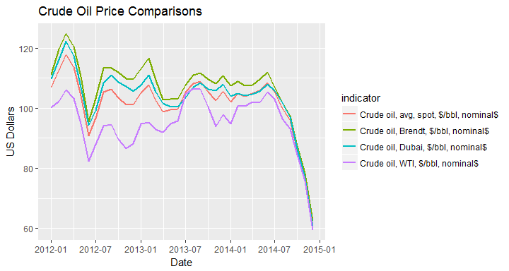
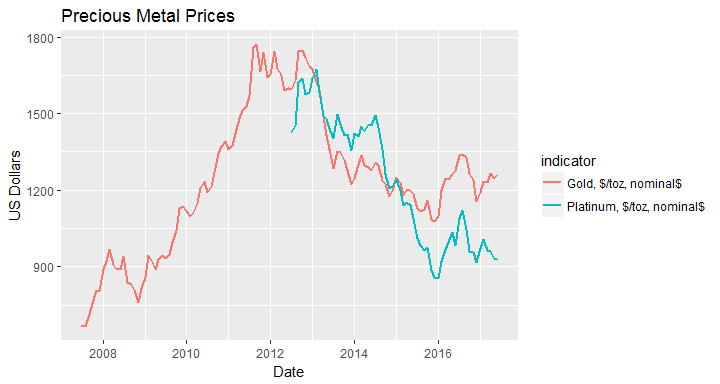

<!-- README.md is generated from README.Rmd. Please edit that file -->
wbstats: An R package for searching and downloading data from the World Bank API.
=================================================================================

You can install:

The latest release version from CRAN with

``` r
install.packages("wbstats")
```

or

The latest development version from github with

``` r
devtools::install_github("GIST-ORNL/wbstats")
```

Introduction
============

The World Bank[1] is a tremendous source of global socio-economic data; spanning several decades and dozens of topics, it has the potential to shed light on numerous global issues. To help provide access to this rich source of information, The World Bank themselves, provide a well structured RESTful API[2]. While this API is very useful for integration into web services and other high-level applications, it becomes quickly overwhelming for researchers who have neither the time nor the expertise to develop software to interface with the API. This leaves the researcher to rely on manual bulk downloads of spreadsheets of the data they are interested in. This too is can quickly become overwhelming, as the work is manual, time consuming, and not easily reproducible. The goal of the `wbstats` R-package is to provide a bridge between these alternatives and allow researchers to focus on their research questions and not the question of accessing the data. The `wbstats` R-package allows researchers to quickly search and download the data of their particular interest in a programmatic and reproducible fashion; this facilitates a seamless integration into their workflow and allows analysis to be quickly rerun on different areas of interest and with realtime access to the latest available data.

### Highlighted features of the `wbstats` R-package:

-   Access to all annual, quarterly, and monthly data available in the API
-   Support for searching and downloading data in multiple languages
-   Access to the World Bank Data Catalog Metadata, providing among other information; update schedules and supported languages
-   Ability to return `POSIXct` dates for easy integration into plotting and time-series analysis techniques
-   Support for Most Recent Value queries
-   Support for `grep` style searching for data descriptions and names
-   Ability to download data not only by country, but by aggregates as well, such as High Income or South Asia

Getting Started
===============

Unless you know the country and indicator codes that you want to download the first step would be searching for the data you are interested in. `wbsearch()` provides `grep` style searching of all available indicators from the World Bank API and returns the indicator information that matches your query.

To access what countries or regions are available you can use the `countries` data frame from either `wb_cachelist` or the saved return from `wbcache()`. This data frame contains relevant information regarding each country or region. More information on how to use this for downloading data is covered later.

Finding available data with `wb_cachelist`
------------------------------------------

For performance and ease of use, a cached version of useful information is provided with the `wbstats` R-package. This data is called `wb_cachelist` and provides a snapshot of available countries, indicators, and other relevant information. `wb_cachelist` is by default the the source from which `wbsearch()` and `wb()` uses to find matching information. The structure of `wb_cachelist` is as follows

``` r
library(wbstats)

str(wb_cachelist, max.level = 1)
#> List of 7
#>  $ countries  :'data.frame': 264 obs. of  14 variables:
#>  $ indicators :'data.frame': 16630 obs. of  6 variables:
#>  $ sources    :'data.frame': 39 obs. of  4 variables:
#>  $ datacatalog:'data.frame': 10 obs. of  25 variables:
#>  $ topics     :'data.frame': 21 obs. of  3 variables:
#>  $ income     :'data.frame': 10 obs. of  2 variables:
#>  $ lending    :'data.frame': 4 obs. of  2 variables:
```

Accessing updated available data with `wbcache()`
-------------------------------------------------

For the most recent information on available data from the World Bank API `wbcache()` downloads an updated version of the information stored in `wb_cachelist`. `wb_cachelist` is simply a saved return of `wbcache(lang = "en")`. To use this updated information in `wbsearch()` or `wb()`, set the `cache` parameter to the saved `list` returned from `wbcache()`. It is always a good idea to use this updated information to insure that you have access to the latest available information, such as newly added indicators or data sources.

``` r
library(wbstats)

# default language is english
new_cache <- wbcache()
```

Search available data with `wbsearch()`
---------------------------------------

`wbsearch()` searches through the `indicators` data frame to find indicators that match a search pattern. An example of the structure of this data frame is below

|      | indicatorID       | indicator                                          | indicatorDesc                                                                                                                                                                                                                                                                                                                                                                                                                                                                                                                                                                                                                                                                                                                                                                                                                                                                                                                                                                                                                                        | sourceOrg                                  | sourceID | source                       |
|------|:------------------|:---------------------------------------------------|:-----------------------------------------------------------------------------------------------------------------------------------------------------------------------------------------------------------------------------------------------------------------------------------------------------------------------------------------------------------------------------------------------------------------------------------------------------------------------------------------------------------------------------------------------------------------------------------------------------------------------------------------------------------------------------------------------------------------------------------------------------------------------------------------------------------------------------------------------------------------------------------------------------------------------------------------------------------------------------------------------------------------------------------------------------|:-------------------------------------------|:---------|:-----------------------------|
| 4310 | DT.IXA.DPPG.CD.CG | Net change in interest arrears (current US$)       | Net change in interest arrears is the variation in the total amount of interest in arrears between two consecutive years. Data are in current U.S. dollars.                                                                                                                                                                                                                                                                                                                                                                                                                                                                                                                                                                                                                                                                                                                                                                                                                                                                                          | World Bank, International Debt Statistics. | 2        | World Development Indicators |
| 4311 | DT.IXA.OFFT.CD    | Interest arrears, official creditors (current US$) | Interest in arrears on long-term debt is defined as interest payment due but not paid, on a cumulative basis. Debt from official creditors includes loans from international organizations (multilateral loans) and loans from governments (bilateral loans). Loans from international organization include loans and credits from the World Bank, regional development banks, and other multilateral and intergovernmental agencies. Excluded are loans from funds administered by an international organization on behalf of a single donor government; these are classified as loans from governments. Government loans include loans from governments and their agencies (including central banks), loans from autonomous bodies, and direct loans from official export credit agencies. Long-term external debt is defined as debt that has an original or extended maturity of more than one year and that is owed to nonresidents by residents of an economy and repayable in currency, goods, or services. Data are in current U.S. dollars. | World Bank, International Debt Statistics. | 2        | World Development Indicators |

By default the search is done over the `indicator` and `indicatorDesc` fields and returns the columns `indicatorID` and `indicator` of the matching rows. The `indicatorID` values are inputs into `wb()`, the function for downloading the data. To return all columns for the `indicators` data frame, you can set `extra = TRUE`.

``` r
library(wbstats)

unemploy_vars <- wbsearch(pattern = "unemployment")
head(unemploy_vars)
#>             indicatorID                             indicator
#> 1750 ccx_unempr_pop_eld           Unemployment rate - elderly
#> 1751 ccx_unempr_pop_fem            Unemployment rate - female
#> 1752 ccx_unempr_pop_mal              Unemployment rate - male
#> 1753 ccx_unempr_pop_rur             Unemployment rate - rural
#> 1754 ccx_unempr_pop_tot Unemployment rate in total population
#> 1755 ccx_unempr_pop_urb             Unemployment rate - urban
```

Other fields can be searched by simply changing the `fields` parameter. For example

``` r
library(wbstats)

blmbrg_vars <- wbsearch(pattern = "Bloomberg", fields = "sourceOrg")
head(blmbrg_vars)
#>      indicatorID                             indicator
#> 1496      BARLEY                Barley, $/mt, current$
#> 1789     CHICKEN     Meat, chicken, cents/kg, current$
#> 1813 CRUDE_BRENT    Crude oil, Brendt, $/bbl, current$
#> 1814 CRUDE_DUBAI     Crude oil, Dubai, $/bbl, current$
#> 1816   CRUDE_WTI       Crude oil, WTI, $/bbl, current$
#> 5370  GFDD.OM.02 Stock market return (%, year-on-year)
```

Regular expressions are also supported.

``` r
library(wbstats)

# 'poverty' OR 'unemployment' OR 'employment'
povemply_vars <- wbsearch(pattern = "poverty|unemployment|employment")

head(povemply_vars)
#>            indicatorID                               indicator
#> 1   1.0.HCount.1.90usd         Poverty Headcount ($1.90 a day)
#> 2    1.0.HCount.2.5usd         Poverty Headcount ($2.50 a day)
#> 3 1.0.HCount.Mid10to50   Middle Class ($10-50 a day) Headcount
#> 4      1.0.HCount.Ofcl Official Moderate Poverty Rate-National
#> 5  1.0.HCount.Poor4uds            Poverty Headcount ($4 a day)
#> 6  1.0.HCount.Vul4to10      Vulnerable ($4-10 a day) Headcount
```

The default cached data in `wb_cachelist` is in English. To search indicators in a different language, you can download an updated copy of `wb_cachelist` using `wbcache()`, with the `lang` parameter set to the language of interest and then set this as the `cache` parameter in `wbsearch()`. Other languages are supported in so far as they are supported by the original data sources. Some sources provide full support for other languages, while some have very limited support. If the data source does not have a translation for a certain field or indicator then the result is `NA`, this may result in a varying number matches depending upon the language you select.

``` r
library(wbstats)

# download wbcache in spanish
wb_cachelist_es <- wbcache(lang = "es")

gini_vars <- wbsearch(pattern = "Coeficiente de Gini", cache = wb_cachelist_es)

head(gini_vars)
#>         indicatorID                                       indicator
#> 136        3.0.Gini                             Coeficiente de Gini
#> 137 3.0.Gini_nozero Coeficiente de Gini (Ingreso diferente de cero)
#> 146   3.0.TheilInd1                          Índice de Theil, GE(1)
#> 159        3.1.Gini                                     Gini, Rural
#> 161   3.1.TheilInd1                   Índice de Theil, GE(1), Rural
#> 172        3.2.Gini                                    Gini, Urbano
```

Downloading data with `wb()`
----------------------------

Once you have found the set of indicators that you would like to explore further, the next step is downloading the data with `wb()`. The following examples are meant to highlight the different ways in which `wb()` can be used and demonstrate the major optional parameters.

The default value for the `country` parameter is a special value of `all` which as you might expect, returns data on the selected `indicator` for every available country or region.

``` r
library(wbstats)

# Population, total
pop_data <- wb(indicator = "SP.POP.TOTL", startdate = 2000, enddate = 2002)

head(pop_data)
#>       value date indicatorID         indicator iso2c
#> 1 293501628 2002 SP.POP.TOTL Population, total    1A
#> 2 287358599 2001 SP.POP.TOTL Population, total    1A
#> 3 281355774 2000 SP.POP.TOTL Population, total    1A
#> 4   6532561 2002 SP.POP.TOTL Population, total    S3
#> 5   6497461 2001 SP.POP.TOTL Population, total    S3
#> 6   6454716 2000 SP.POP.TOTL Population, total    S3
#>                  country
#> 1             Arab World
#> 2             Arab World
#> 3             Arab World
#> 4 Caribbean small states
#> 5 Caribbean small states
#> 6 Caribbean small states
```

If you are interested in only some subset of countries or regions you can pass along the specific codes to the `country` parameter. The country and region codes that can be passed to the `country` parameter correspond to the coded values from the `iso2c`, `iso3c`, `regionID`, `adminID`, and `incomeID` from the `countries` data frame in `wb_cachelist` or the return of `wbcache()`. Any values from the above columns can mixed together and passed to the same call

``` r
library(wbstats)

# Population, total
# country values: iso3c, iso2c, regionID, adminID, incomeID
pop_data <- wb(country = c("ABW","AF", "SSF", "ECA", "NOC"),
               indicator = "SP.POP.TOTL", startdate = 2012, enddate = 2012)

head(pop_data)
#>       value date indicatorID         indicator iso2c
#> 1    102393 2012 SP.POP.TOTL Population, total    AW
#> 2  29726803 2012 SP.POP.TOTL Population, total    AF
#> 3 259879171 2012 SP.POP.TOTL Population, total    7E
#> 4 323348755 2012 SP.POP.TOTL Population, total    XR
#> 5 922840423 2012 SP.POP.TOTL Population, total    ZG
#>                                   country
#> 1                                   Aruba
#> 2                             Afghanistan
#> 3 Europe & Central Asia (developing only)
#> 4                    High income: nonOECD
#> 5  Sub-Saharan Africa (all income levels)
```

Queries with multiple indicators return the data in a long data format

``` r
library(wbstats)

pop_gdp_data <- wb(country = c("US", "NO"), indicator = c("SP.POP.TOTL", "NY.GDP.MKTP.CD"),
               startdate = 1971, enddate = 1971)

head(pop_gdp_data)
#>          value date    indicatorID                          indicator
#> 1 3.903039e+06 1971    SP.POP.TOTL                  Population, total
#> 2 2.076610e+08 1971    SP.POP.TOTL                  Population, total
#> 3 1.458311e+10 1971 NY.GDP.MKTP.CD GDP at market prices (current US$)
#> 4 1.167770e+12 1971 NY.GDP.MKTP.CD GDP at market prices (current US$)
#>   iso2c       country
#> 1    NO        Norway
#> 2    US United States
#> 3    NO        Norway
#> 4    US United States
```

### Using `mrv`

If you do not know the latest date an indicator you are interested in is available for you country you can use the `mrv` instead of `startdate` and `enddate`. `mrv` stands for most recent value and takes a `integer` corresponding to the number of most recent values you wish to return

``` r
library(wbstats)

eg_data <- wb(country = c("IN"), indicator = 'EG.ELC.ACCS.ZS', mrv = 1)

eg_data
#>   value date    indicatorID                               indicator iso2c
#> 1  78.7 2012 EG.ELC.ACCS.ZS Access to electricity (% of population)    IN
#>   country
#> 1   India
```

You can increase this value and it will return no more than the `mrv` value. However, if `mrv` is greater than the number of available data it will return less

``` r
library(wbstats)

eg_data <- wb(country = c("IN"), indicator = 'EG.ELC.ACCS.ZS', mrv = 10)

eg_data
#>   value date    indicatorID                               indicator iso2c
#> 1  78.7 2012 EG.ELC.ACCS.ZS Access to electricity (% of population)    IN
#> 2  75.0 2010 EG.ELC.ACCS.ZS Access to electricity (% of population)    IN
#> 3  62.3 2000 EG.ELC.ACCS.ZS Access to electricity (% of population)    IN
#> 4  50.9 1990 EG.ELC.ACCS.ZS Access to electricity (% of population)    IN
#>   country
#> 1   India
#> 2   India
#> 3   India
#> 4   India
```

### Using `gapfill = TRUE`

An additional parameter that can be used along with `mrv` is `gapfill`. `gapfill` allows you to "fill-in" the values between actual observations. The "filled-in" value for an otherwise missing date is the last observed value carried forward.The only difference in the data call below from the one directly above is `gapfill = TRUE` (the default is `FALSE`). Note the very important difference

``` r
library(wbstats)

eg_data <- wb(country = c("IN"), indicator = 'EG.ELC.ACCS.ZS', mrv = 10, gapfill = TRUE)

eg_data
#>    value date    indicatorID                               indicator iso2c
#> 1   78.7 2015 EG.ELC.ACCS.ZS Access to electricity (% of population)    IN
#> 2   78.7 2014 EG.ELC.ACCS.ZS Access to electricity (% of population)    IN
#> 3   78.7 2013 EG.ELC.ACCS.ZS Access to electricity (% of population)    IN
#> 4   78.7 2012 EG.ELC.ACCS.ZS Access to electricity (% of population)    IN
#> 5   75.0 2011 EG.ELC.ACCS.ZS Access to electricity (% of population)    IN
#> 6   75.0 2010 EG.ELC.ACCS.ZS Access to electricity (% of population)    IN
#> 7   62.3 2009 EG.ELC.ACCS.ZS Access to electricity (% of population)    IN
#> 8   62.3 2008 EG.ELC.ACCS.ZS Access to electricity (% of population)    IN
#> 9   62.3 2007 EG.ELC.ACCS.ZS Access to electricity (% of population)    IN
#> 10  62.3 2006 EG.ELC.ACCS.ZS Access to electricity (% of population)    IN
#>    country
#> 1    India
#> 2    India
#> 3    India
#> 4    India
#> 5    India
#> 6    India
#> 7    India
#> 8    India
#> 9    India
#> 10   India
```

Because `gapfill` returns data that does reflect actual observed values, use this option with care.

### Using `POSIXct = TRUE`

The default format for the `date` column is not conducive to sorting or plotting, especially when downloading sub annual data, such as monthly or quarterly data. To address this, if `TRUE`, the `POSIXct` parameter adds the additional columns `date_ct` and `granularity`. `date_ct` converts the default date into a `POSIXct`. `granularity` denotes the time resolution that the date represents. This option requires the use of the package `lubridate (>= 1.5.0)`. If `POSIXct = TRUE` and `lubridate (>= 1.5.0)` is not available, a `warning` is produced and the option is ignored

``` r
library(wbstats)

oil_data <- wb(indicator = "CRUDE_BRENT", mrv = 10, freq = "M", POSIXct = TRUE)

head(oil_data)
#>   value    date indicatorID                          indicator iso2c
#> 1 57.93 2015M02 CRUDE_BRENT Crude oil, Brendt, $/bbl, nominal$    1W
#> 2 48.07 2015M01 CRUDE_BRENT Crude oil, Brendt, $/bbl, nominal$    1W
#> 3 62.33 2014M12 CRUDE_BRENT Crude oil, Brendt, $/bbl, nominal$    1W
#> 4 78.44 2014M11 CRUDE_BRENT Crude oil, Brendt, $/bbl, nominal$    1W
#> 5 87.27 2014M10 CRUDE_BRENT Crude oil, Brendt, $/bbl, nominal$    1W
#> 6 97.34 2014M09 CRUDE_BRENT Crude oil, Brendt, $/bbl, nominal$    1W
#>   country    date_ct granularity
#> 1   World 2015-02-01     monthly
#> 2   World 2015-01-01     monthly
#> 3   World 2014-12-01     monthly
#> 4   World 2014-11-01     monthly
#> 5   World 2014-10-01     monthly
#> 6   World 2014-09-01     monthly
```

The `POSIXct = TRUE` option makes plotting and sorting dates much easier.

``` r
library(wbstats)
library(ggplot2)
#> Warning: package 'ggplot2' was built under R version 3.2.3

oil_data <- wb(indicator = c("CRUDE_DUBAI", "CRUDE_BRENT", "CRUDE_WTI", "CRUDE_PETRO"),
               startdate = "2012M01", enddate = "2014M12", freq = "M", POSIXct = TRUE)

ggplot(oil_data, aes(x = date_ct, y = value, colour = indicator)) + geom_line(size = 1) +
  labs(title = "Crude Oil Price Comparisons", x = "Date", y = "US Dollars")
```

<!-- -->

The `POSIXct = TRUE` option also makes plotting time series with different time coverage seamless

``` r
library(wbstats)
library(ggplot2)

# querying seperate for differing time coverage example
gold_data <- wb(indicator = "GOLD", mrv = 120, freq = "M", POSIXct = TRUE)
plat_data <- wb(indicator = "PLATINUM", mrv = 60, freq = "M", POSIXct = TRUE)

metal_data <- rbind(gold_data, plat_data)

ggplot(metal_data, aes(x = date_ct, y = value, colour = indicator)) + geom_line(size = 1) +
  labs(title = "Precious Metal Prices", x = "Date", y = "US Dollars")
```

<!-- -->

Some Sharp Corners
==================

There are a few behaviors of the World Bank API that being aware of could help explain some potentially unexpected results. These results are known but no special actions are taken to mitigate them as they are the result of the API itself and artifically limiting the inputs or results could potentially causes problems or create unnecessary rescrictions in the future.

Non-overlaping time frames
--------------------------

If you make a query with `wb()` and the `startdate` and `enddate` no not overlap at all with the available data, then all of the data is returned instead of nothing.

``` r
library(wbstats)

pop_data <- wb(country = "US", indicator = "SP.POP.TOTL", 
               startdate = 1800, enddate = 1805, POSIXct = TRUE)

nrow(pop_data)
#> [1] 55
max(pop_data$date_ct)
#> [1] "2014-01-01"
min(pop_data$date_ct)
#> [1] "1960-01-01"
```

Most Recent Values
------------------

If you use the `mrv` parameter in `wb()` with mutliple countries or regions, it searches for the most recent dates for which any country or region in your selection has data and then returns the data for those dates. In other words the `mrv` value is not determined on a country by country basis, rather it is determined across the entire selection.

``` r
library(wbstats)

eg_data_1 <- wb(country = c("IN", "AF"), indicator = 'EG.FEC.RNEW.ZS', mrv = 1)
eg_data_1
#>      value date    indicatorID
#> 2 38.99062 2012 EG.FEC.RNEW.ZS
#>                                                            indicator iso2c
#> 2 Renewable energy consumption (% of total final energy consumption)    IN
#>   country
#> 2   India

eg_data_2 <- wb(country = c("IN", "AF"), indicator = 'EG.FEC.RNEW.ZS', mrv = 2)
eg_data_2
#>      value date    indicatorID
#> 2 10.80752 2011 EG.FEC.RNEW.ZS
#> 3 38.99062 2012 EG.FEC.RNEW.ZS
#> 4 39.85413 2011 EG.FEC.RNEW.ZS
#>                                                            indicator iso2c
#> 2 Renewable energy consumption (% of total final energy consumption)    AF
#> 3 Renewable energy consumption (% of total final energy consumption)    IN
#> 4 Renewable energy consumption (% of total final energy consumption)    IN
#>       country
#> 2 Afghanistan
#> 3       India
#> 4       India
```

Searching in other languages
----------------------------

Not all data sources support all languages. If an indicator does not have a translation for a particular language, the non-supported fields will return as `NA`. This could potentially result in a differing number of matching indicators from `wbsearch()`

``` r

library(wbstats)

# english
cache_en <- wbcache()
sum(is.na(cache_en$indicators$indicator))
#> [1] 0

# spanish
cache_es <- wbcache(lang = "es")
sum(is.na(cache_es$indicators$indicator))
#> [1] 14909
```

Legal
=====

The World Bank Group, or any of its member instutions, do not support or endorse this software and are not libable for any findings or conclusions that come from the use of this software.

[1] <http://www.worldbank.org/>

[2] <http://data.worldbank.org/developers>
